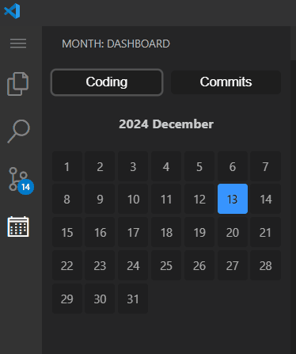

# Month Extension for Visual Studio Code

The **Month** extension for Visual Studio Code helps you track and visualize your daily project work and GitHub commits. It provides a calendar view in the activity bar where you can see which projects you've worked on each day, along with a tab that shows your GitHub commit history.

## Features

- **Interactive Calendar View**: Display a month-by-month calendar showing days when coding activities or GitHub commits occurred, with color-coded indicators.

- **Two Graph Views**: Toggle between two views:

  - **Coding Time**: Visualize your daily coding activity with project folder data.

  - **Commit History**: View your GitHub commits for each day of the month.

- **Detailed Activity View**: Click on any day in the calendar to see a detailed breakdown of the activities, including the list of folders for coding or repositories for commits. Clicking on a folder name will open the corresponding project folder, and clicking on a repository name will open the GitHub repository URL.

## Requirements

- GitHub account for commit tracking.

## Configuration

- The extension fetches data from GitHub using the **GitHub GraphQL API**. It will ask for authentication the first time you use it.
  
- The calendar only tracks project data for the last month, filtering out older data automatically.

## License

This extension is open source and available under the [MIT License](LICENSE).

## Contact

- **Author**: [Adhishtanaka](https://github.com/Adhishtanaka)
- **Email**: kulasoooriyaa@gmail.com

## Contributing

If you find any bugs or want to suggest improvements, feel free to open an issue or pull request on the [GitHub repository](https://github.com/Adhishtanaka/Month-Extension).
